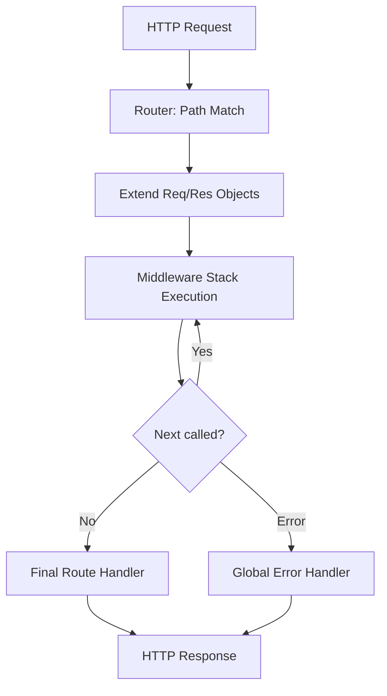

# Architecture Overivew

The framework is designed with a modular approach, separating the routing logic, middleware management, and request/response enhancements.

## Core Components

### 1. The Application (`App`)
The `App` class serves as the central orchestrator. It holds instances of the `Router` and `MiddlewareManager`. When `app.listen()` is called, it creates a native Node.js HTTP server and pipes all requests through `handleRequest()`.

### 2. The Router
The router uses a list of registered routes. Each route path is converted into a **Regular Expression** with named capturing groups (to extract parameters like `:id`).
When a request arrives, the router iterates through the list to find the first match based on the HTTP method and pathname.

### 3. Middleware Manager
The middleware system follows a linear execution model. Global middlewares are stored in a stack, and when a route is matched, its handlers are appended to this stack for that specific request lifecycle.
The execution is controlled by a recursive `next()` function which also handles error propagation.

## Request Lifecycle

1. **Incoming Request**: Native `http.IncomingMessage` arrives at the server.
2. **Matching**: Router finds the corresponding route and extracts URL parameters.
3. **Enhancement**: `req` and `res` are extended with helper methods (`json`, `status`, `params`, etc.).
4. **Middleware Stack**:
   - Executes Global Middlewares.
   - Executes Route-specific Middlewares (if any).
   - Executes the final Route Handler.
5. **Flow Control**:
   - `next()` moves to the next handler.
   - `next(err)` jumps to the global error handler.
   - `res.end()` (or `res.json()`, `res.send()`) terminates the response.
6. **Error Handling**: Any thrown error or `next(err)` call is caught and sent to the custom or default error middleware.

